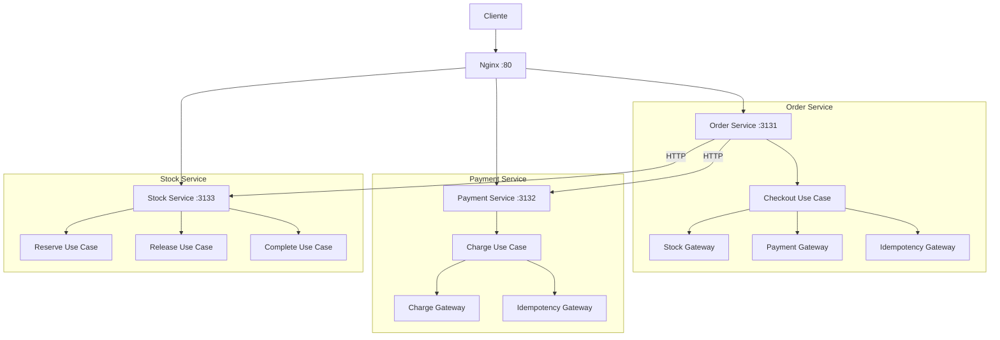
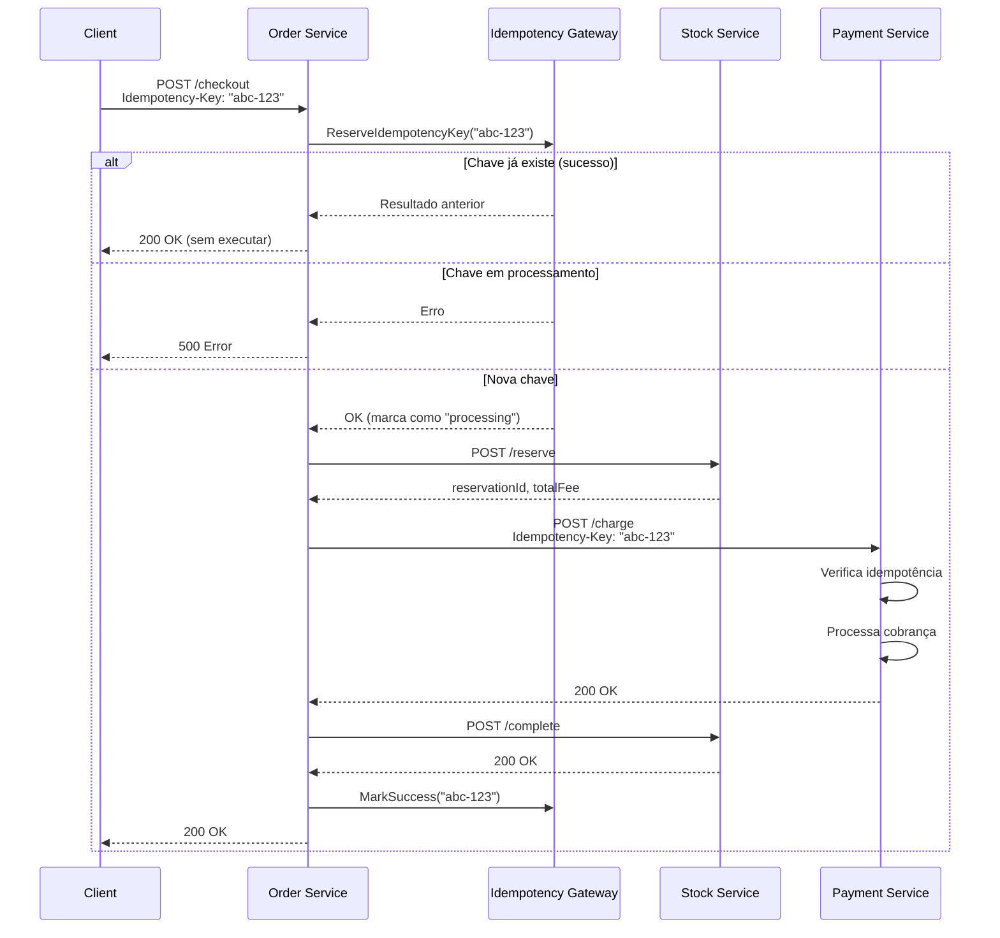
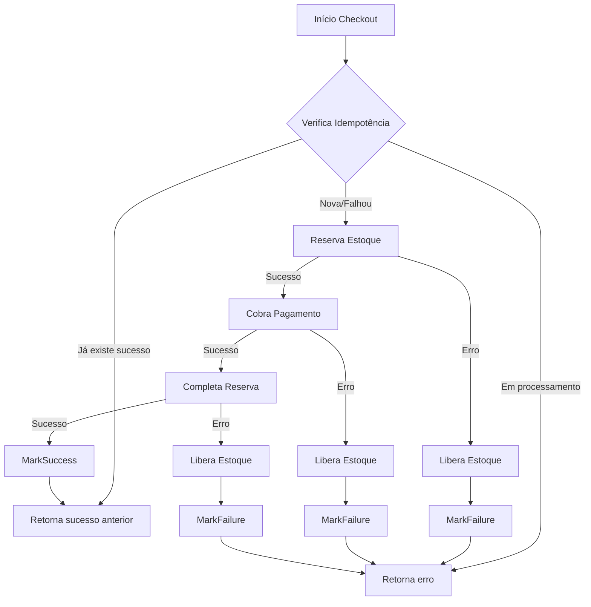
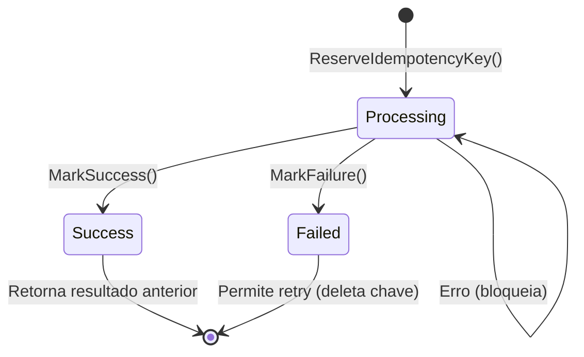
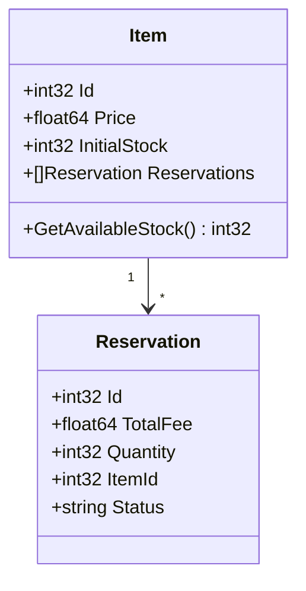

# 💳 Payments System - Projeto de Estudos

## 📋 Sobre o Projeto

Este é um **projeto de estudos** focado em explorar conceitos fundamentais de sistemas distribuídos:

- **Idempotência**: Garantir que operações possam ser executadas múltiplas vezes sem efeitos colaterais
- **Tolerância a Falhas**: Sistema resiliente que continua funcionando mesmo quando componentes falham (inclui **retry com backoff exponencial** onde necessário)
- **Escalabilidade**: Arquitetura preparada para crescer e lidar com aumento de carga

O projeto simula um sistema de e-commerce com três serviços independentes que trabalham juntos para processar pedidos, gerenciar estoque e processar pagamentos.

---

## 🏗️ Arquitetura do Sistema

### Visão Geral

O sistema é composto por **3 microserviços** independentes, orquestrados por um serviço de **Order** e expostos através de um **Nginx** como reverse proxy.



### Componentes

#### 1. **Order Service** (Porta 3131)
- **Responsabilidade**: Orquestrar o processo de checkout
- **Endpoints**:
  - `POST /checkout` - Processa um pedido completo
- **Dependências**: Stock Service, Payment Service
- **Idempotência**: ✅ Implementada

#### 2. **Payment Service** (Porta 3132)
- **Responsabilidade**: Processar pagamentos
- **Endpoints**:
  - `POST /charge` - Cobra um valor do cliente
- **Idempotência**: ✅ Implementada

#### 3. **Stock Service** (Porta 3133)
- **Responsabilidade**: Gerenciar estoque e reservas
- **Endpoints**:
  - `POST /reserve` - Reserva itens do estoque
  - `POST /release` - Libera uma reserva
  - `POST /complete` - Completa uma reserva (após pagamento)
- **Idempotência**: ⚠️ Parcial (melhorias pendentes)

#### 4. **Nginx** (Porta 80)
- **Responsabilidade**: Reverse proxy e roteamento
- **Rotas**:
  - `/order/*` → Order Service
  - `/payment/*` → Payment Service
  - `/stock/*` → Stock Service

---

## 🔄 Fluxo de Checkout

### Diagrama de Sequência



### Fluxo Detalhado

1. **Cliente envia requisição de checkout**
   - Inclui `Idempotency-Key` no header
   - Envia `itemId` e `quantity`

2. **Order Service verifica idempotência**
   - Se chave já existe e foi bem-sucedida → retorna resultado anterior
   - Se chave está em processamento → retorna erro
   - Se chave falhou anteriormente → permite retry (deleta chave)

3. **Reserva de estoque**
   - Order Service chama Stock Service
   - Stock verifica disponibilidade
   - Cria reserva com status "reserved"
   - Retorna `reservationId` e `totalFee`

4. **Processamento de pagamento**
   - Order Service chama Payment Service
   - Payment Service também verifica idempotência
   - Processa cobrança
   - Retorna sucesso

5. **Completar reserva**
   - Order Service chama Stock Service para completar
   - Stock atualiza status para "completed"

6. **Marcar sucesso**
   - Order Service marca idempotência como "success"
   - Retorna sucesso ao cliente

### Tratamento de Erros



---

## 🔐 Implementação de Idempotência

### Estratégia Implementada

Utilizamos **idempotência baseada em chaves** (`Idempotency-Key`), seguindo o padrão comum em APIs REST.

#### Estados da Idempotência



### Order Service - Checkout

**Status**: ✅ **Implementado**

**Características**:
- Header `Idempotency-Key` obrigatório
- Gateway de idempotência com estados: `processing`, `success`, `failed`
- Thread-safe com `sync.RWMutex`
- Retorna resultado anterior quando chave já existe
- Bloqueia requisições concorrentes com mesma chave
- Marca sucesso/falha automaticamente

**Implementação**:
```go
// order/infra/gateways/checkout.go
type CheckoutGatewayMemory struct {
    mutex           sync.RWMutex
    idempotencyKeys map[string]*ChekoutState
}

// Estados: "processing", "success", "failed"
```

### Payment Service - Charge

**Status**: ✅ **Implementado**

**Características**:
- Header `Idempotency-Key` obrigatório
- Mesma implementação do Order Service
- Thread-safe
- Protege contra cobranças duplicadas

**Implementação**:
```go
// payment/infra/gateways/idempotency.go
type IdempotencyGatewayMemory struct {
    mutex           sync.RWMutex
    idempotencyKeys map[string]*IdempotencyState
}
```

### Stock Service

**Status**: ⚠️ **Parcial**

**Endpoints**:
- `/reserve`: ❌ Sem idempotência explícita (protegido via checkout)
- `/release`: ⚠️ Parcial (não verifica estado antes de executar)
- `/complete`: ⚠️ Parcial (não verifica estado antes de executar)

**Melhorias Pendentes**:
- Tornar `/release` idempotente verificando se já está "canceled"
- Tornar `/complete` idempotente verificando se já está "completed"

---

## 📊 Estrutura de Dados

### Reserva de Estoque



**Estados da Reserva**:
- `reserved`: Reservado, aguardando pagamento
- `canceled`: Cancelado (liberado)
- `completed`: Completo (pago e finalizado)

---

## 🚀 Como Executar

### Pré-requisitos

- Docker e Docker Compose
- Go 1.21+ (para desenvolvimento local)

### Executando com Docker Compose

```bash
# Subir todos os serviços
docker-compose up --build

# Os serviços estarão disponíveis em:
# - Order: http://localhost/order
# - Payment: http://localhost/payment
# - Stock: http://localhost/stock
```

### Executando Localmente

```bash
# Terminal 1 - Stock Service
cd stock && go run main.go

# Terminal 2 - Payment Service
cd payment && go run main.go

# Terminal 3 - Order Service
cd order && go run main.go

# Terminal 4 - Nginx (opcional)
docker run -p 80:80 -v $(pwd)/nginx.conf:/etc/nginx/nginx.conf:ro nginx
```

### Testando o Checkout

```bash
curl -X POST http://localhost/order/checkout \
  -H "Content-Type: application/json" \
  -H "Idempotency-Key: abc-123" \
  -d '{
    "itemId": 1,
    "quantity": 2
  }'
```

---

## 📝 O Que Foi Implementado

### ✅ Fase 1: Arquitetura Base

- [x] Estrutura de 3 microserviços independentes
- [x] Comunicação HTTP entre serviços
- [x] Nginx como reverse proxy
- [x] Docker Compose para orquestração
- [x] Estrutura de código seguindo Clean Architecture

### ✅ Fase 2: Idempotência

- [x] **Order Service - Checkout**
  - [x] Gateway de idempotência com estados
  - [x] Thread-safe com mutex
  - [x] Retorno de resultado anterior
  - [x] Bloqueio de requisições concorrentes
  - [x] Marcação automática de sucesso/falha
  - [x] Testes completos (12 testes)

- [x] **Payment Service - Charge**
  - [x] Gateway de idempotência idêntico ao checkout
  - [x] Thread-safe
  - [x] Proteção contra cobranças duplicadas
  - [x] Testes completos (11 testes)

- [x] **Documentação**
  - [x] README detalhado
  - [x] Diagramas de arquitetura
  - [x] Fluxos de execução

### ✅ Backoff Exponencial (Tolerância a Falhas)

- [x] **Order Service – chamadas ao Stock**
  - [x] Retry com backoff exponencial em: reserva de estoque (`Reserve`), conclusão da reserva (`Complete`) e liberação em caso de falha (`Release`)
  - [x] Até 5 tentativas com delay exponencial (1s → 2s → 4s → 8s → 16s)
  - [x] Implementado em `order/use_cases/checkout.go` via `RetryWithBackoff`

### ⚠️ Pendente: Melhorias no Stock Service

- [ ] Tornar `/release` idempotente (verificar estado)
- [ ] Tornar `/complete` idempotente (verificar estado)
- [ ] Adicionar idempotência explícita em `/reserve` (opcional)

---

## 🎯 Próximos Passos

### 🔄 Tolerância a Falhas

#### 1. Retry com Backoff Exponencial ✅ Implementado
**Objetivo**: Recuperar automaticamente de falhas transitórias nas chamadas ao Stock Service.

**Implementação** (já em uso):
- Retry com backoff exponencial nas operações de estoque no **Order Service**: `Reserve`, `Complete` e `Release` (em cenário de compensação)
- Até 5 tentativas com delay exponencial: 1s → 2s → 4s → 8s → 16s
- Código em `order/use_cases/checkout.go` (`RetryWithBackoff` + `Sleeper` injetável para testes)

**Benefícios**:
- Sistema mais resiliente a falhas de rede ou indisponibilidade temporária do Stock
- Melhora a experiência do usuário em cenários de falha transitória

#### 2. Circuit Breaker
**Objetivo**: Evitar sobrecarga em serviços degradados

**Implementação**:
- Circuit breaker nos gateways HTTP
- Estados: Closed → Open → Half-Open
- Abre após N falhas consecutivas
- Tenta reabrir após timeout

**Benefícios**:
- Fail-fast quando serviço está indisponível
- Protege serviços saudáveis de sobrecarga

#### 3. Timeout e Context Propagation
**Objetivo**: Evitar requisições travadas indefinidamente

**Implementação**:
- Timeouts configuráveis nos HTTP clients
- Uso de `context.Context` para cancelamento
- Propagação de context entre serviços

**Benefícios**:
- Evita travamentos
- Melhor controle de tempo de resposta

#### 4. Saga Pattern para Transações Distribuídas
**Objetivo**: Garantir consistência eventual em caso de falhas

**Implementação**:
- Compensação automática
- Se `Complete` falhar após `Charge`, reverter pagamento
- Manter estado da transação para compensação

**Benefícios**:
- Consistência eventual garantida
- Recuperação automática de falhas parciais

### 📈 Escalabilidade

#### 1. Health Checks
**Objetivo**: Monitoramento e balanceamento de carga

**Implementação**:
- Endpoint `/health` em cada serviço
- Verifica dependências (banco, outros serviços)
- Retorna status: `healthy`, `degraded`, `unhealthy`

**Benefícios**:
- Melhor observabilidade
- Suporte a load balancers

#### 2. Distributed Tracing
**Objetivo**: Rastrear requisições entre serviços

**Implementação**:
- Correlação de requisições com `X-Request-ID`
- Logs estruturados com trace ID
- Opcional: integração com Jaeger/Zipkin

**Benefícios**:
- Debug facilitado em sistemas distribuídos
- Melhor observabilidade

#### 3. Graceful Shutdown
**Objetivo**: Desligamento seguro dos serviços

**Implementação**:
- Captura de sinais (SIGTERM, SIGINT)
- Finalização de requisições em andamento
- Timeout para requisições pendentes

**Benefícios**:
- Desligamento sem perda de dados
- Melhor experiência em deployments

#### 4. Persistência de Idempotência
**Objetivo**: Idempotência sobrevive a reinicializações

**Implementação**:
- Migrar de memória para Redis ou banco de dados
- TTL configurável para chaves de idempotência
- Limpeza automática de chaves antigas

**Benefícios**:
- Idempotência persistente
- Suporte a múltiplas instâncias

### 🔍 Observabilidade

#### 1. Logging Estruturado
**Objetivo**: Logs mais úteis para debugging

**Implementação**:
- Logs estruturados (JSON)
- Níveis de log (DEBUG, INFO, WARN, ERROR)
- Contexto rico (trace ID, user ID, etc.)

#### 2. Métricas
**Objetivo**: Monitorar performance e saúde do sistema

**Implementação**:
- Endpoint `/metrics` (Prometheus)
- Métricas: latência, taxa de erro, throughput
- Opcional: Grafana para visualização

---

## 🧪 Testes

### Cobertura Atual

- ✅ **Order Service**: 12 testes (checkout + idempotência)
- ✅ **Payment Service**: 11 testes (charge + idempotência)
- ⚠️ **Stock Service**: Testes unitários básicos

### Executando Testes

```bash
# Todos os testes
go test ./...

# Testes com cobertura
go test ./... -cover

# Testes verbosos
go test ./... -v
```

---

## 📚 Conceitos Explorados

### Idempotência

**Definição**: Operação que pode ser executada múltiplas vezes produzindo o mesmo resultado.

**Implementação**:
- Chaves de idempotência (`Idempotency-Key`)
- Estados: `processing`, `success`, `failed`
- Retorno de resultado anterior
- Thread-safety

### Tolerância a Falhas

**Implementado**:
- **Retry com backoff exponencial** nas chamadas ao Stock (reserva, complete, release) no fluxo de checkout

**Conceitos a explorar**:
- Circuit breaker
- Timeout e cancelamento
- Compensação (Saga)

### Escalabilidade

**Conceitos a explorar**:
- Health checks
- Distributed tracing
- Graceful shutdown
- Persistência distribuída

---

## 🏛️ Arquitetura de Código

### Estrutura de Diretórios

```
payments/
├── order/
│   ├── cmd/
│   │   └── api/          # HTTP server
│   ├── domain/           # Entidades de negócio
│   ├── use_cases/        # Casos de uso
│   ├── infra/
│   │   └── gateways/     # Adaptadores HTTP
│   └── protocols/        # Interfaces
├── payment/
│   ├── cmd/
│   │   └── api/
│   ├── use_cases/
│   ├── infra/
│   │   └── gateways/
│   └── protocols/
├── stock/
│   ├── cmd/
│   │   └── api/
│   ├── domain/
│   │   └── item/
│   ├── use_cases/
│   │   ├── reserve/
│   │   ├── release/
│   │   └── complete/
│   └── infra/
│       └── repositories/
├── docker-compose.yml
├── nginx.conf
└── README.md
```

### Princípios Aplicados

- **Clean Architecture**: Separação de responsabilidades
- **Dependency Inversion**: Interfaces definem contratos
- **Single Responsibility**: Cada use case tem uma responsabilidade
- **Testabilidade**: Mocks e testes isolados

---

## 🔗 Referências

- [Idempotency Keys](https://stripe.com/docs/api/idempotent_requests)
- [Circuit Breaker Pattern](https://martinfowler.com/bliki/CircuitBreaker.html)
- [Saga Pattern](https://microservices.io/patterns/data/saga.html)
- [Distributed Tracing](https://opentracing.io/)

---

## 📄 Licença

Este é um projeto de estudos. Sinta-se livre para usar como referência.

