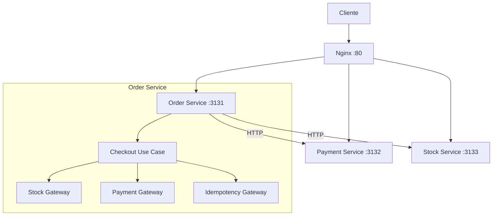

# 💳 Payments System - Projeto de Estudos

## Descrição do projeto e arquitetura

Projeto de estudos focado em conceitos de sistemas distribuídos: **idempotência**, **tolerância a falhas** (retry com backoff exponencial, timeout e propagação de context) e **escalabilidade**. Simula um e-commerce com três serviços: Order (checkout), Payment (cobrança) e Stock (reservas), orquestrados pelo Order e expostos via Nginx.

### Visão geral

- **Order** (3131): `POST /checkout` — orquestra reserva (Stock), cobrança (Payment) e idempotência.
- **Payment** (3132): `POST /charge` — cobrança com idempotência.
- **Stock** (3133): `POST /reserve`, `POST /release`, `POST /complete` — reservas e estados (`reserved`, `canceled`, `completed`).
- **Nginx** (80): reverse proxy (`/order/*`, `/payment/*`, `/stock/*`).

### Fluxo de checkout

Cliente envia `POST /checkout` com `Idempotency-Key`. Order reserva idempotência → chama Stock (`/reserve`) → Payment (`/charge`) → Stock (`/complete`) → marca idempotência como sucesso. Em falha, libera estoque e marca falha. Idempotência: estados `processing`, `success`, `failed`; retorno do resultado anterior quando a chave já existe.

**Como executar:** [docs/executing.md](docs/executing.md) — Docker, local e teste do checkout. Pode ser necessário alterar as URLs nos gateways do Order (`order/infra/gateways/stock.go`, `order/infra/gateways/payment.go`) conforme você rode com Docker (hostnames `stock`, `payment`) ou local (`localhost`).

---

## Conceitos explorados

- **Idempotência** — Operação que pode ser repetida sem efeitos colaterais. Implementada com `Idempotency-Key` em Order (checkout) e Payment (charge); estados `processing`, `success`, `failed`; thread-safe. Stock: idempotência parcial (melhorias em issues).
- **Tolerância a falhas** — Retry com backoff exponencial (Order → Stock: Reserve, Complete, Release) e timeout/propagação de context no checkout (504 para timeout). A explorar: circuit breaker, Saga.
- **Escalabilidade** — A explorar: health checks, distributed tracing, graceful shutdown, persistência de idempotência.
- **Observabilidade** — A explorar: logging estruturado, métricas (Prometheus).

---

## Princípios

- **Clean Architecture** — Separação de responsabilidades (cmd, domain, use_cases, infra, protocols).
- **Dependency Inversion** — Interfaces em `protocols/`, implementações em `infra/gateways`.
- **Single Responsibility** — Um use case por fluxo.
- **Testabilidade** — Mocks e testes isolados (Order: 12 testes, Payment: 11 testes).

Estrutura: `order/`, `payment/`, `stock/` — cada um com `cmd/`, `use_cases/`, `infra/`, `protocols/` (e `domain/` onde aplicável).

---

## Referências

- [Idempotency Keys](https://stripe.com/docs/api/idempotent_requests)
- [Circuit Breaker Pattern](https://martinfowler.com/bliki/CircuitBreaker.html)
- [Saga Pattern](https://microservices.io/patterns/data/saga.html)
- [Distributed Tracing](https://opentracing.io/)

---

## Licença

Este é um projeto de estudos. Sinta-se livre para usar como referência.
